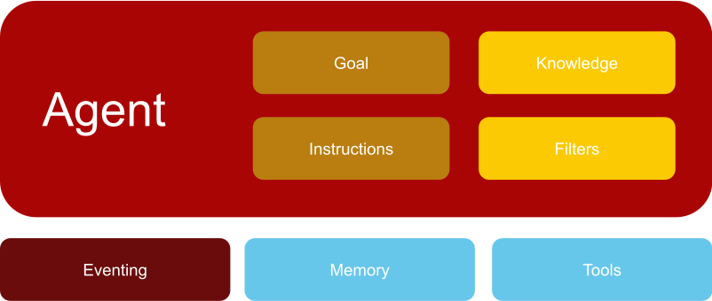

# Arc Agents

Welcome to Arc Agents, a kotlin based framework for writing AI powered applications.

At its core the Arc Framework defines an Agent DSL. A domain specific language 
designed specifically for building LLM powered Agents concisely and efficiently.

Although the Agent DSL can be used directly in any kotlin application, the true power of the 
Framework comes to shine when combining the DSL with kotlin scripting.
Unleashing the rapid development and testing of Agents.

But let's start with an abstract definition of what an Agent is.

## What is an Agent?



### Agents

An Arc Agent is basically a collection of Large Language Model prompts, filters, events,
readers and other services that combined can perform a complex task.

### Goal and Instructions

Each Agent should have a single goal or task they are designed to complete from which they should not deviate.

For example, a joke agent's goal is to tell jokes. It should not be possible to use the joke agent to do anything
else, such as, maths homework.

Example of instructions for a weather agent:

```md  
# Goal

You are a professional weather agent. You provide weather data to your users.
```

How an Agent arrives at its goal is defined by the instructions given to it.

Example of instructions for a weather agent:

```md  
# Instructions

- If the user asks a question that is not related to weather,
  simply reply I cant help you
- Be kind and friendly to the user.
- Inform the user that the weather data is not real-time data.
- Use the get_weather function to get the weather data.
```

Both the goal and instructions of an Agent are defined within an Agent's System Prompt.

See [Defining Agents](dsl/defining_agents) for more details.

### Knowledge

Knowledge or Knowledge Injection refers to supplying Agents with additional information that
they require perform their tasks.

For example, a Travel Agent may need to know the current Holiday packages that are available.

There are 2 ways to dynamically inject knowledge into an Agent, [Readers](readers) and [Functions](dsl/defining_functions).
Both mechanisms enable Agents to access real-time data.

Static Knowledge can simple be added to the System Prompt of the Agent.

### Filters

The purpose of filters is to transform, augment, validate or filter the input and output of Agents.

Input filters, for example, can be used to anonymize sensitive data before handing it to the Agent LLM.
And Output filters can be used to detect Hallucinations generated by the Agent LLM.

See [Filters](dsl/filters) for more details.


### Tools

Tools enable Agents to access external services and data. 
Tools are a powerful way to extend the capabilities of an Agent. Enabling Agents to not only retrieve data, 
but to also execute real-world actions, such as turning on a light or even booking a flight.

For example, a Weather Agent may use a Weather Tool to get the weather data. 
Whereas a Travel Agent may use the Booking Tool to book flights.

Tools are often implemented as Functions. See [Functions](dsl/defining_functions) for more details.

### Memory

Memory is the ability of an Agent to store and retrieve information.

There are 2 types of memory:

- `LONG_TERM` - information stored in long term memory is persistent and can be accessed by the Agent at any time.
- `SHORT_TERM` - information stored in short term memory is only available for the duration of a conversation.

Each information stored in memory is associated with an owner, usually the user defined in the conversation.

See the chapter on [Memory](memory) for available implementations.

### Eventing

Eventing is a great way to decouple communication between different parts of an application. 
Agents can emit multiple events during the precessing of a request.

See the [Eventing](/docs/arc/eventing) for more details.